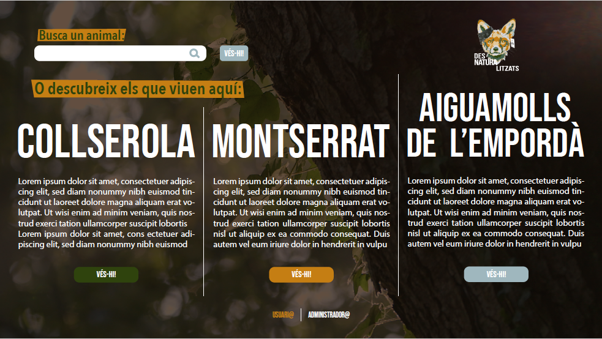
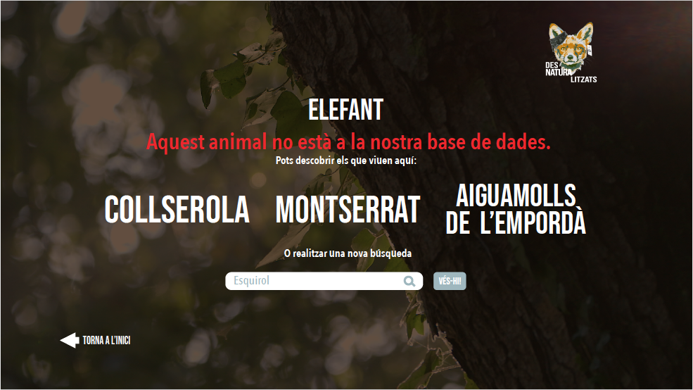
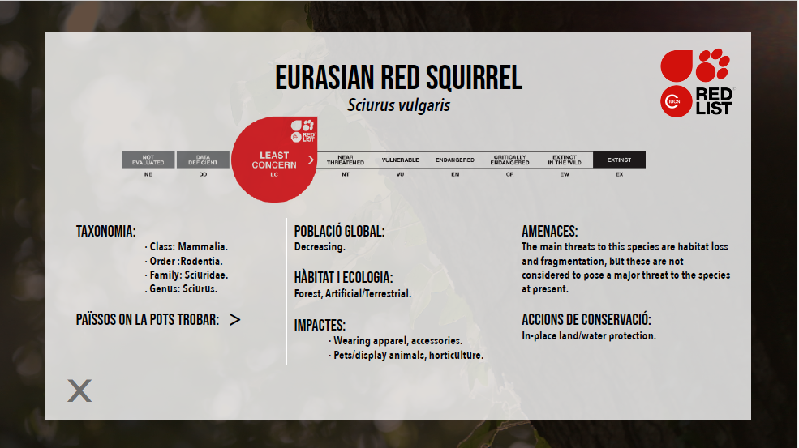
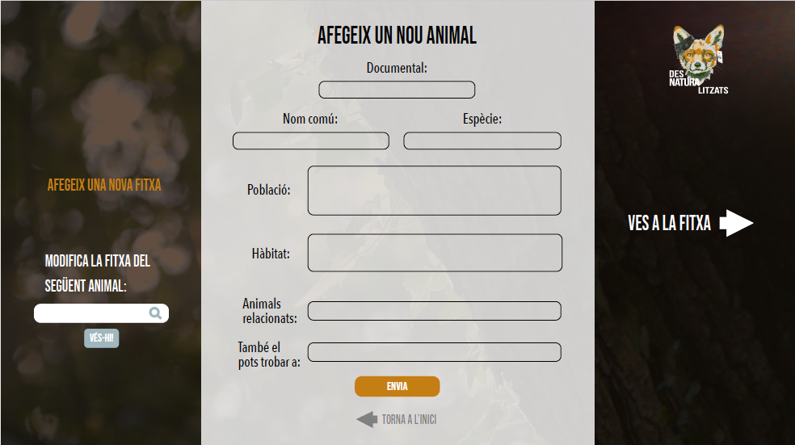
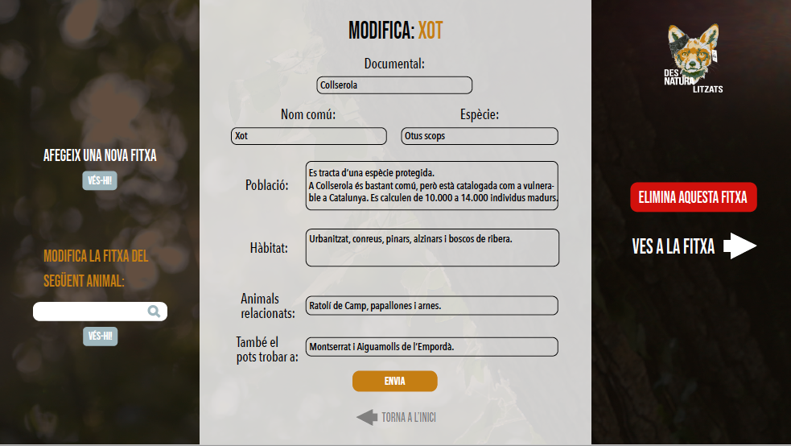
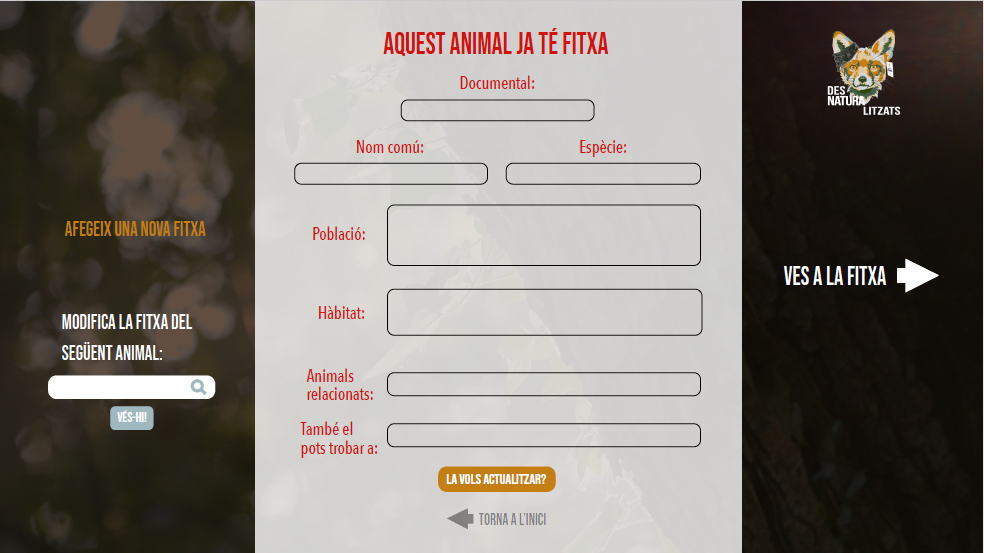

# Animal Cards for Desnaturalitzats

## Before Start:

Look in the other Readme file **user-side** to see how to install properly all the technologies that you're going to need.

### Briefing
The main **objective** of this project is to increase and complement the information of the animals and regions that appears in the Desnaturalitzats documentaries.

The app is divided in two parts: the **user** and the **admin** sides.

-`HOW THE USER SIDE LOOKS LIKE`
**missing** a view with the list of all the animals there are in each region.

-`HOW THE ADMIN SIDE LOOKS LIKE`
**missing** a view with the logging for acces to the admin options.

